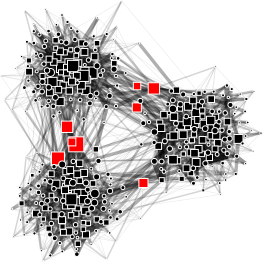
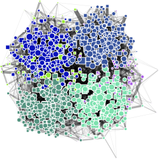
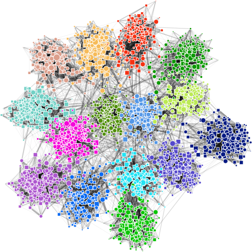

### BNOC: A benchmarking tool to generate bipartite, k-partite and heterogeneous network models with overlapping communities

**About**

BNOC is a tool for synthesizing bipartite, k-partite and heterogeneous network models with varied features representative of properties from real networks. Multiple input parameters can be manipulated to create networks of varying sizes and with distinct community patterns in terms of number, size, balance, edge distribution intra- and inter-communities, degree of overlapping and cohesion, and degree of noise in the connection patterns.

> **:warning: The original implementation is deprecated. This software is a new version, more robust and fast. I.e
>., there may be divergences between this version and the original algorithm.
If you looking for the original version used in the paper don't hesitate to contact the authors.**

> To help you visualize networks you can use the PyNetViewer software. You can download this software in:
> https://github.com/alanvalejo/pynetviewer

**Usage**

	$ python bnoc.py [options]

| Option             | Domain                       | Default                  | Description                                                   |
| ------------------ | ---------------------------- | ------------------------ | ------------------------------------------------------------- |
| -dir --directory   | str [DIR]                    | '.'                      | directory of output file                                      |
| -out --output      | str [FILE]                   | 'out'                    | filename                                                      |
| -cnf --conf        | str [FILE]                   | None                     | Input parameters in .json format                              |
| -v, --vertices     | int array                    | [10, 10, 10]             | number of vertices for each layer                             |
| -d, --dispersion   | float array                  | [0.3, 0.3, 0.3]          | dispersion of gamma mixing distribution for each layer        |
| -m, --mu           | float array                  | [0.3, 0.3, 0.3]          | dispersion or range of wieght values for each layer           |
| -c, --communities  | int array                    | [2, 2, 2]                | number of communities                                         |
| -x, --x            | int array                    | [1, 1, 1]                | number of vertices from V1 that participate of overlapin      |
| -z, --z            | int array                    | [2, 2, 2]                | number of vertices of overlapping communities                 |
| -p, --p            | int array of array           | [[0.5, 0.5], [0.5, 0.5]] | probability of vertices in each community for each layer      |
| -e, --scheme       | int array of array           | [[0, 1], [1,2]]          | connections type                                              |
| -n, --noise        | float array                  | [0.1, 0.1]               | noise for each connections type                               |
| -b, --balanced     | boolean                      | False                    | boolean balancing flag that suppresses -p parameter           |
| -u, --unweighted   | boolean                      | False                    | unweighted networks                                           |
| -no, --normalize   | boolean                      | False                    | scale input vectors individually to unit norm (vector length) |
| -hd, --hard        | boolean                      | False                    | hard noise                                                    |
| --save_npy         | boolean                      | False                    | save numpy object                                             |
| --save_ncol        | boolean                      | False                    | save ncol format                                              |
| --save_gmal        | boolean                      | False                    | save gml format                                               |
| --save_arff        | boolean                      | False                    | save arff format                                              |
| --save_cover       | boolean                      | False                    | save communities in cover form                                |
| --save_membership  | boolean                      | False                    | save communities in a membership format                       |
| --save_type        | boolean                      | False                    | save vertex type                                              |
| --save_overlap     | boolean                      | False                    | save save overlap vertices                                    |
| --show_timing      | boolean                      | False                    | show timing                                                   |
| --save_timing_json | boolean                      | False                    | save timing in json                                           |
| --save_timing_csv  | boolean                      | False                    | save timing in csv                                            |
| --unique_key       | boolean                      | False                    | output date and time as unique_key                            |

Parameters `-d`, `-m`, `-c`, `-x`, `-y` and `-z` are array of size L, where L is the number of layer. Parameter `p` is an array of array the probability of vertices in each community for each layer. Parameter `e` define the scheme of the networks, i.e., the connections type.

**Examples**

You can use a config file (.json) to specify the parameters, for instance:

	$ python bnoc.py -cnf input/input_bipartite_1.json
	$ python bnoc.py -cnf input/input_bipartite_2.json
	$ python bnoc.py -cnf input/input_bipartite_3.json
	$ python bnoc.py -cnf input/input_kpartite.json
	$ python bnoc.py -cnf input/input_heterogeneous.json
	
Then, it is possible plot the network using the PyNetViewer.
	
	$ python viewer.py -cnf input/plot_bipartite_1_layout_1.json
	$ python viewer.py -cnf input/plot_bipartite_1_layout_2.json
	$ python viewer.py -cnf input/plot_bipartite_2.json
	$ python viewer.py -cnf input/plot_bipartite_3.json
	$ python viewer.py -cnf input/plot_kpartite.json
	$ python viewer.py -cnf input/plot_heterogeneous.json

Bipartite First Layout             | Bipartite Second Layout                 
:---------------------------------:|:----------------------------------------:
 | 

Bipartite First Layout             | Bipartite Second Layout                 
:---------------------------------:|:----------------------------------------:
 | 

Kpartite                          |  Heterogeneoous
:---------------------------------:|:-------------------------------------:
  | 

**Scalability**

BNOC can generate large-scale bipartite networks with tens or even hundreds of thousands of vertices and hundreds of millions of edges in a timely manner. See the article for details about complexity and scalability.

Important, save the output files in text format is slow. It is recommended save the result with numpy `.npy` object, see [numpy.save](https://docs.scipy.org/doc/numpy-1.15.1/reference/generated/numpy.save.html) for details.

For instance, a bipartite network with twenty thousand vertices (use `--show_timing` to print timing values):

    $ python bnoc.py -cnf input/input_bipartite_time_ncol.json

    $        Snippet       Time [m]       Time [s]
    $ Pre-processing            0.0         0.0213
    $     Build BNOC            0.0         2.6187
    $           Save            1.0         34.596

Note, the bottleneck of the Bnoc execution time is to save the output in a text format. To suppress this limitation you can process the network directly in the memory or save a `.npy` object using `--output_npy` or `-onpy` parameter.

    $ python bnoc.py -cnf input/input_bipartite_time_npy.json

    $        Snippet       Time [m]       Time [s]
    $ Pre-processing            0.0         0.0223
    $     Build BNOC            0.0         2.4116
    $           Save            1.0         0.2627

**Install**

> Pip
    
    $ pip install -r requirements.txt

> Anaconda env

    $ conda env create -f environment.yml
    $ conda activate bnoc

> Anaconda create

    $ conda create --name bnoc python=3.7.2
    $ conda activate bnoc
    $ conda install -c anaconda pyyaml
    $ conda install -c conda-forge pypdf2
    $ conda install -c anaconda scipy

**Known Bugs**

- Please contact the author for problems and bug report.

**Contact**

- Alan Valejo <alanvalejo@gmail.com.br>
- Postdoctoral research fellow at the University of São Paulo (USP), Brazil

**License and credits**

- Giving credit to the author by citing the papers [1]
- The GNU General Public License v3.0
- This program comes with ABSOLUTELY NO WARRANTY. THE ENTIRE RISK AS TO THE QUALITY AND PERFORMANCE OF THE PROGRAM IS WITH YOU
- Owner or contributors are not liable for any direct, indirect, incidental,
special, exemplary, or consequential damages, (such as loss of data or profits, and others) arising in any way out of the use of this software, even if advised of the possibility of such damage.
- This program is free software and distributed in the hope that it will be useful: you can redistribute it and/or modify it under the terms of the GNU General Public License as published by the Free Software Foundation, either version 3 of the License, or (at your option) any later version. See the GNU General Public License for more details. You should have received a copy of the GNU General Public License along with this program. If not, see http://www.gnu.org/licenses/.

**To-do list**

- Explicitly seed a global variable or parameter to achieve reproducibility
- Improve usage section

**References**

> [1] Valejo, Alan and Goes, F. and Romanetto, L. M. and Oliveira, Maria C. F. and Lopes, A. A., A benchmarking tool for the generation of bipartite network models with overlapping communities, in Knowledge and information systems, accepted paper, 2019

~~~~~{.bib}
@article{valejo2019benchmarking,
    author = {Valejo, Alan and Goes, F. and Romanetto, L. M. and Oliveira, Maria C. F. and Lopes, A. A.},
    title = {A benchmarking tool for the generation of bipartite network models with overlapping communities},
    journal = {Knowledge and information systems, accepted paper},
    year = {2019}
}
~~~~~

 &copy; Copyright (C) 2016 Alan Valejo &lt;alanvalejo@gmail.com&gt; All rights reserved.

